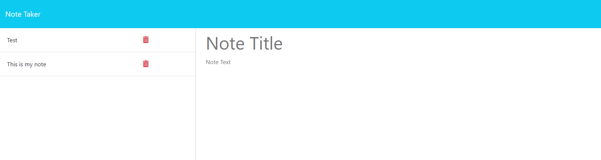

# NOTE TAKER APP

## Description

The Note Taker App allows users to create notes consisting of a title and a description which can be saved or deleted to a json database.

## Installation

To initialize the app you will need a code editing software (such as VScode), nodejs, and server software (either an active deployment from a web server or a local server with auto updating software such as nodemon). 

If running locally, first navigate to the root folder of of the app (note_taker_2) and open the location in your code editor's terminal. Go ahead and install packages with node's:
npm i 
Then you will want to run nodemon or any active server software you have on the server.js file. From here enter the following into your internet browser's search bar:
localhost:3001
Doing so will send you to the home page of the Note Taker App!

If deploying from a website, the base route will be dependant on your domain name or server provider.

## Usage

Once you have successfully ran the files and connected to the active home page, you will see the following screen:

Clicking on the 'Get Started' button will take you to the application, while clicking the 'Note Taker' in the top left will return you to this home page (this link exists on both the home and app pages).

Once you reach the app page, you will see the following:

From here, users can click on 'Note Title' or 'Note Text' to input their own information. 'Title' has a character limit while 'Note Text' can fit much more information. While writing the note, users will notice two additional buttons that appear:

'Clear Form' allows the user to clear all currently written information in their displayed note, it appears once text is written to either the title or note text.
'Save Note' allows the user to save their note's information to the database - it only appears when text is written into both the title and note text. Once clicked, the following will appear on the application:

The active note area will reset and the information the user put in is pushed to the database, then that information is rendered on the note list on the left. Users can click the name of the note on the left to render it to the area on the right, but they cannot edit the information, only create a new note:

At any point a user can click on the red trashcan next to a note's title to delete it from the database and remove it from the list:

And that is the functionality of the app!

## Credits

Starter code from UC Berkely

## License

N/A